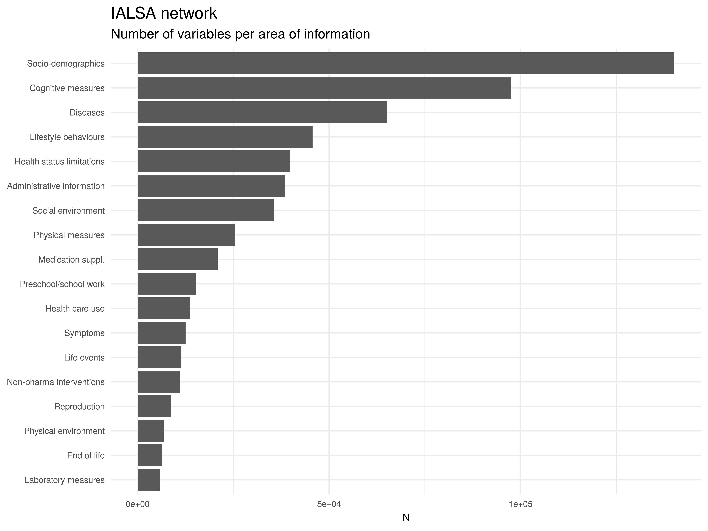

```{r setup, include=FALSE}
options(htmltools.dir.version = FALSE)
```

```{r comment='#',echo=FALSE,cache=TRUE,warning=FALSE,include=FALSE,message=FALSE}
source("01-dhaine-get_data.R")
source("02a-dhaine-make_dataset_IALSA.R")
```

# From studies' objectives:

```{r echo=FALSE,fig.align='center'}

```

---

# IALSA in Maelstrom catalogue

```{r echo=FALSE,include=FALSE}
library(tidyverse)
```

- `r length(study_network$acronym)` IALSA studies
- `r length(athlos_studies$acronym)` ATHLOS studies
- `r nrow(athlos_studies %>% filter(!(acronym %in% study_network$acronym)) %>%
  select(acronym))` ATHLOS studies not in IALSA (ATTICA, CHARLS, COURAGE in
  Europe, 10/66, ENRICA, HAPIEE, JSTAR, SAGE)
- `r length(mindmap_studies$acronym)` MINDMAP studies
- `r nrow(mindmap_studies %>% filter(!(acronym %in% study_network$acronym)) %>%
  select(acronym))` MINDMAP studies not in IALSA (GLOBE, HAPIEE, HUNT, LUCAS,
  MESA Neighbourhood, RECORD, RS, TLS)
- `r length(near_studies$acronym)` NEAR studies
- `r nrow(near_studies %>% filter(!(acronym %in% study_network$acronym)) %>% select(acronym))` NEAR studies not in IALSA (COSM, SMC)

---
# Participants

```{r echo=FALSE,fig.align='center',out.width="90%"}

```

---

```{r echo=FALSE,fig.align='center',out.width="90%"}

```

---
# Biosamples

```{r echo=FALSE,fig.align='center',out.width="90%"}

```

---
# Where?

```{r echo=FALSE,fig.align='center'}

```

---

```{r echo=FALSE,fig.align='center'}

```

---
# When?

```{r echo=FALSE,fig.align='center',out.width="90%"}

```

---
# Still working?

```{r echo=FALSE,fig.align='center',out.width="90%"}

```

---
# Do we have their variables?

```{r echo=FALSE,fig.align='center',out.width="90%"}

```

---
# What?

```{r echo=FALSE,fig.align='center',out.width="90%"}

```

---
# Taxonomies

```{r echo=FALSE,fig.align='center',out.width="90%"}
knitr::include_graphics("ialsa_area_taxo.jpg")
```

---

```{r echo=FALSE,fig.align='center',out.width="90%"}

```

---

```{r echo=FALSE,fig.align='center',out.width="90%"}

```

---

```{r echo=FALSE,fig.align='center',out.width="90%"}

```

---
# Network analysis

```{r echo=FALSE,fig.align='center',out.width="90%"}

```

---

```{r echo=FALSE,fig.align='center',out.width="90%"}

```

---

```{r echo=FALSE,include=FALSE}
library(tidyverse)
library(tidygraph)
library(ggraph)
library(networkD3)
```

```{r echo=FALSE,warning=FALSE,include=FALSE,cache=TRUE}
source("02b-dhaine-make_dataset_ATHLOS.R")
source("02c-dhaine-make_dataset_MINDMAP.R")
source("02d-dhaine-make_dataset_NEAR.R")

ialsa_cog <- study_by_cog_scale %>%
  drop_na() %>%
  filter(Mlstr_cogscale.Cog_scale %in% c("Clock_Drawing_CDT",
                                         "MOCA",
                                         "GPCOG",
                                         "CDR")) %>%
  mutate(study = "IALSA")
athlos_cog <- athlos_by_cog_scale %>%
  drop_na() %>%
  filter(Mlstr_cogscale.Cog_scale %in% c("Clock_Drawing_CDT",
                                         "MOCA",
                                         "GPCOG",
                                         "CDR")) %>%
  mutate(study = ifelse(!(acronym %in% ialsa_cog$acronym), "ATHLOS", "IALSA")) %>%
  filter(study == "ATHLOS")
near_cog <- near_by_cog_scale %>%
  drop_na() %>%
  filter(Mlstr_cogscale.Cog_scale %in% c("Clock_Drawing_CDT",
                                         "MOCA",
                                         "GPCOG",
                                         "CDR")) %>%
  mutate(study = ifelse(!(acronym %in% ialsa_cog$acronym), "NEAR", "IALSA")) %>%
  filter(study == "NEAR")
ialsa_cog <- rbind(ialsa_cog, athlos_cog)

nodes <- data.frame(acronym = unique(ialsa_cog$acronym)) %>%
  rowid_to_column("id") %>%
  rename(label = acronym)
nodes <- left_join(nodes, ialsa_cog %>% select(acronym, study) %>% unique(),
                   by = c("label" = "acronym"))

temp <- merge(ialsa_cog[, 1:2], ialsa_cog[, 1:2], by = "Mlstr_cogscale.Cog_scale")
edges_cog <- temp[temp$acronym.x != temp$acronym.y, ]
edges_cog <- edges_cog[, c(2, 3, 1)]

edges <- edges_cog %>%
  left_join(nodes[, 1:2], by = c("acronym.x" = "label")) %>%
  rename(from = id)
edges <- edges %>%
  left_join(nodes[, 1:2], by = c("acronym.y" = "label")) %>%
  rename(to = id)

edges <- left_join(edges, ialsa_cog %>% select(acronym, study) %>% unique(),
                   by = c("acronym.x" = "acronym"))

edges <- select(edges, from, to, Mlstr_cogscale.Cog_scale, study) %>%
  rename(cog_scale = Mlstr_cogscale.Cog_scale)
edges

nodes_d3 <- mutate(nodes, id = id - 1) %>%
    arrange(id, label, study)
edges_d3 <- mutate(edges, from = from - 1, to = to - 1) %>%
    arrange(from, to, cog_scale, study)

F2 <- colorRampPalette(c("#FFFF00", "#FF0000"),
                       bias = nrow(edges),
                       space = "rgb",
                       interpolate = "linear")
colCodes <- F2(length(unique(edges$cog_scale)))
edges_col <- sapply(edges$cog_scale,
                   function(x) colCodes[which(sort(unique(edges$cog_scale)) == x)])
```

```{r echo=FALSE}
forceNetwork(Links = edges_d3,
                Nodes = nodes_d3,
                Source = "from",
                Target = "to",
                NodeID = "label",
                Group = "study",
                linkColour = edges_col,
                linkWidth = 1,
                charge = -300,
                opacity = 1,
                fontSize = 12,
                zoom = TRUE,
                legend = TRUE,
                width = 600,
                height = 600)
```
---
class: center,middle

```{r echo=FALSE,fig.align='center',out.width="40%"}
knitr::include_graphics("logo.png")
```

dhaine@maelstrom-research.org

ifortier@maelstrom-research.org
